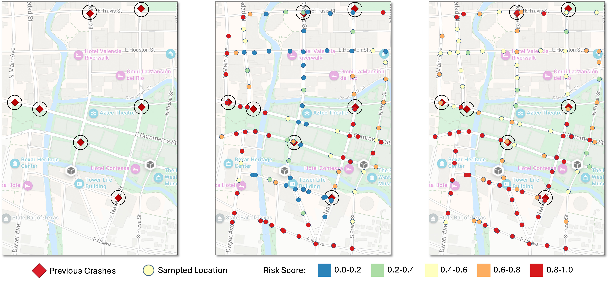

# BetaRisk: Probabilistic Roadway Crash Risk Assessment
<div align="center">

  [](https://aaai.org/conference/aaai/aaai-26)&nbsp;&nbsp;
  [](https://www.gb-liang.com/betarisk/index.html)&nbsp;&nbsp;
  [](https://arxiv.org/abs/2404.06637)&nbsp;&nbsp;

  [Ahmad Elallaf](https://www.linkedin.com/in/ahmadhamdy60344b234/),&nbsp;&nbsp;
  [Nathan Jacobs](https://jacobsn.github.io),&nbsp;&nbsp;
  [Xinyue Ye](https://geography.ua.edu/people/xinyue-ye),&nbsp;&nbsp;
  [Mei Chen](https://engr.uky.edu/people/mei-chen),&nbsp;&nbsp;
  [Gongbo Liang](https://www.gb-liang.com),&nbsp;&nbsp;

</div>

<!--Official implementation of ```BetaRisk```, a model that predicts uncertainty-aware roadway crash risk from satellite imagery by estimating a full Beta probability distribution.-->


### 📖 About The Project
Roadway safety models often produce a single, deterministic risk score, which fails to capture the model's own uncertainty--a critical flaw in safety--critical applications. ```BetaRisk``` addresses this by reframing risk assessment as a probabilistic learning problem. Instead of a single number, our model uses deep learning to analyze satellite imagery and predict a full **Beta probability distribution** of crash risk. This provides a richer, more trustworthy assessment by quantifying both the most likely risk and the model's confidence in that prediction.

<div align="center">
  
</div>

<div align="left">
  
**Figure 1.** A case study comparison for the San Antonio River Walk area. In the middle and right panels, each colored dot represents a sampled location where a risk score was predicted. **(Left) Ground Truth:** The locations of previous fatal crashes are shown as red diamonds. **(Middle) Baseline Model:** The baseline exhibits low recall, incorrectly assigning low-risk scores (blue) to many known crash sites at the sampled locations. **(Right) Our Model:** Our model demonstrates superior recall by correctly identifying more hazardous locations with elevated risk scores (yellow and orange), generating a more realistic and spatially coherent risk map.
</div>
  

### ✨ Key Features
- **Probabilistic Formulation:** Outputs the ```α``` and ```β``` parameters of a Beta distribution to capture both risk and uncertainty for every prediction.
- **Vision-Based:** Uses multi-scale satellite imagery as the sole input to learn the complex interplay of environmental risk factors.
- **State-of-the-Art Performance:** Achieves a 38-42% relative improvement in recall and superior model calibration (ECE) compared to strong baselines.

### 📊 Qualitative Results
A key advantage of ```BetaRisk``` is the interpretability of its predictions.

|Baseline vs. BetaRisk|Input to Output Example|
|----------------------|----------------------|
|Our model (Figure 1 Right) produces a more nuanced and spatially coherent risk map compared to the baseline (Figure 1 Left).|```BetaRisk``` analyzes a satellite image (Figure 2 Top) and outputs a full probability distribution of its risk (Figure 2 Bottom), showing its confidence.|

### 📜 Citation
```
@inproceedings{elallaf2026betarisk,
  title={BetaRisk: Probabilistic Roadway Crash Risk Assessment},
  author={Elallaf, Ahmad and Jacobs, Nathan and Ye, Xinyue and Chen, Mei and Liang, Gongbo},
  booktitle={Proceedings of the AAAI Conference on Artificial Intelligence},
  year={2026}
}
```

#### 📄 License
Distributed under the MIT License. See ```LICENSE``` for more information.


